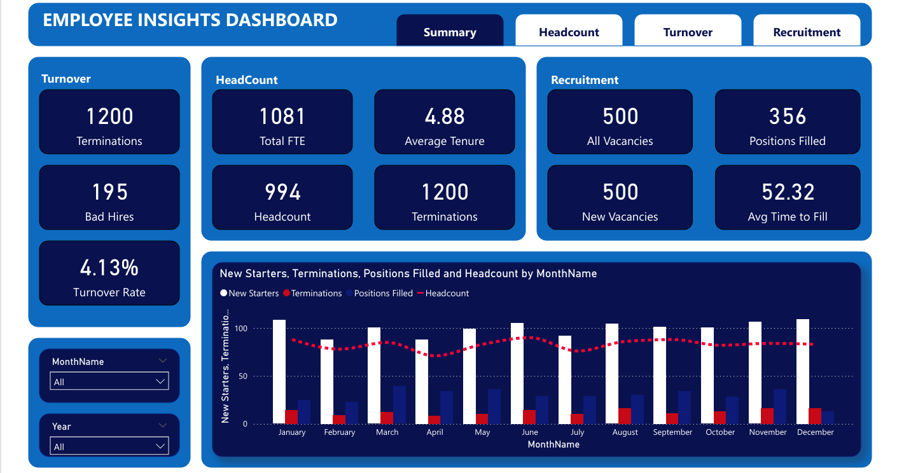
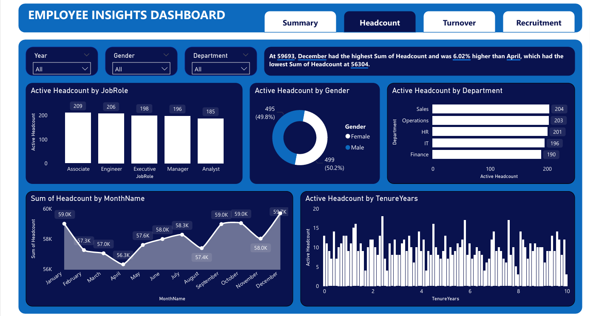
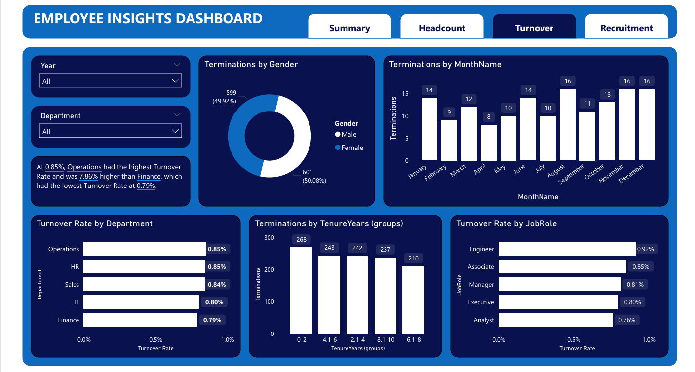
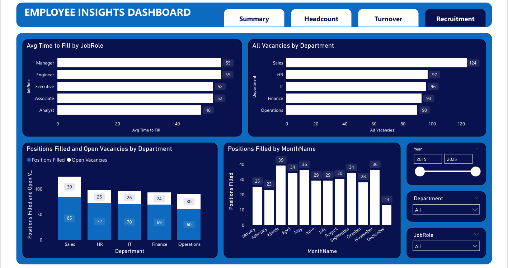

# Employee Insights Dashboard (Power BI)

## 📌 Project Overview
This project analyzes employee data to identify trends in attrition, salary distribution, performance, and department-wise insights.

## 📊 Tools Used
- Power BI
- Excel / CSV
- Data Cleaning
- DAX Functions

## 📈 Key Insights
- Attrition rate analysis
- Salary distribution by department
- Performance rating trends
- Gender diversity insights
- Experience vs Salary comparison

## 📂 Files Included
- Employee_Insights_Dashboard.pbix
- Employee_Master.csv
- Headcount_Snapshot.csv
- Recruitment.csv
- Date_Dim.csv

## 🖼 Dashboard Preview

